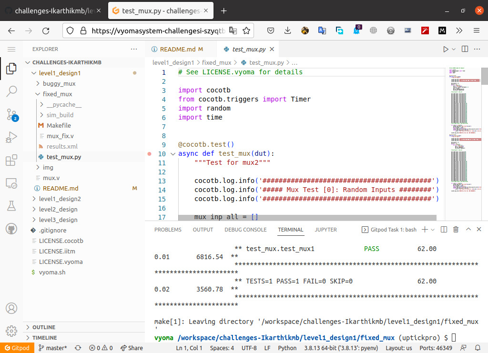

# Mux Desing Verification

The verification environment is setup using Vyoma's UpTickPro provided for the hackathon.



## Verification environment

The CoCoTb based Python test is developed as explained. The test drives inputs to the Design Under Test (Mux module here) which takes in 31 input ports (inp#) with each 2-bits, 4-bit select (sel) ports and results in 2-bit output port (out).

(Note: here inp# refers to the range from inp0,inp1 to inp30)

A random 2-bit value is assigned to each input port (inp#) and is tested for output based on sequential select (sel) cases.

The assert statement is used for comparing the Mux output to the expected value.

The following error is seen:

```verilog
assert dut.out.value ==  mux_inr[s_val],f"Mux result is incorrect; inp{s_val}: dut.out.value = {dut.out.value} != {mux_inr[s_val]}"
```

## Test Scenario #1

**Test Inputs:** 00, 01, 10, 11

Inputs are all same either 00's or 01's or 10's or 11's

**Result:** No change in the output and no bugs detected.

**Description:** The goal of the verification is to test all the necessary inputs. While testing I noticed the inp12 was erraneous, but when the input signal are similar (either 0's or 1's or 01's or 10's) this bug could not be identified. Thus it is important to verify every test scenario.

## Test Scenario #2

**Inputs:**

| Input | Value |
| --- | --- |
| inp13 | 0b10 |
| sel | 13 |

**Output:**

| Output | Observed | Expected |
| --- | --- | --- |
| out | 0b01 | 0b10 |

### Design Bug

The case selection 12 should be inp12 instead inp13's output is observed due to error in bits selection.

```verilog
// mux.v
      5'b01101: out = inp12; // bug#: selection 13 assigned to inp12 
```

### Design Fix

From the desing, case-13 is defined two times, in one of them inp12 is assigned to case-13. To rectify this the error bits in `5’b01101` are corrected to `5'01100` which is case-12 will resolve this issue.

```verilog
// mux_fix.v
      5'b01100: out = inp12; // corrected statement
```

## Test Scenario #3

**Inputs:**

| Input | Value |
| --- | --- |
| inp30 | 0b1 |
| sel | 30 |

**Output:**

| Output | Observed | Expected |
| --- | --- | --- |
| out | 00 | 0b1 |

### Design Bug

The mux design consists of 5-bit selection pins which means 2^5(=32) actual selection pins are necessary instead 30 are available in the design. No assignment for inp30 is found in the design mux.v

### Design Fix

Since there is no assignment for the pin inp31, default case is been executed and outputs `'b00` which is is not the expected value. To fix this we need to define 30th pin (i.e inp30) inside the case of the design which looks as the following 

```verilog
// mux_fixed.v
5'b11110: out = inp30; // fixed bug#3
```

---

> The updated design is checked in as mux_fix.v
> 

## Verification Strategy

### **Testcase: test_mux**

In this test case, I have generated random input (inp#) values with incremental case selections (sel) to monitor the output (out). 

### **Testcase: test_mux1**

In this test, I applied gray code inputs (inp#) values with incremental case selection (sel) to monitor the output (out). This makes sure same bit is not sent twice in a row and assers the wrongful values if present.
