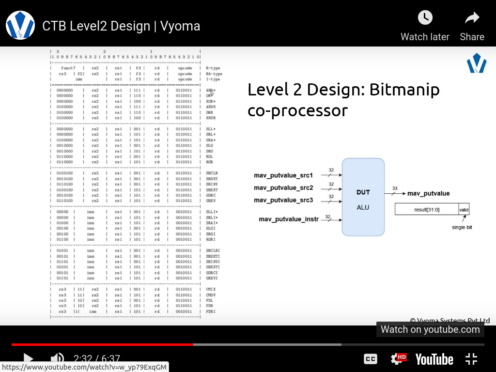

# README-L2

# **Bitmanipulation Coprocessor Verification**

The verification environment is setup using Vyoma's UpTickPro provided for the hackathon.



## **Verification environment**

The CoCoTb based Python test is developed as explained. The test drives input instructions to the Design Under Test (mkbitmanip here) which takes three numbers of 32-bit input sources (`mav_putvalue_src1, mav_putvalue_src2, mav_putvalue_src3``) along with 32 bit instruction (`mav_putvalue_instr`) to yield 33-bit output (`mav_putvalue`)

The following message is seen:

```verilog
// test_mkbitmanip.py
error_message = f'Value mismatch DUT = {hex(dut_output)} does not match MODEL = {hex(expected_mav_putvalue)}'
assert dut_output == expected_mav_putvalue, error_message
```

## Test Scenario #1

**Inputs:**

| Input | Value |
| --- | --- |
| mav_putvalue_src1 | 0x5 |
| mav_putvalue_src2 | 0b11111111111111111111111111111111 |
| mav_putvalue_src3 | 0b00000000000000000000000000000011 |
| mav_putvalue_instr | 0x40007033 |

**Output:**

| Output | Observed | Expected |
| --- | --- | --- |
| mav_putvalue | 0xb | 0x1 |

### Design Bug

The output value of the design block is not similart expected value from model block. The error message is displayed below:

```bash
DUT OUTPUT=0xb != EXPECTED=0x1 | NOT_MATCHED
```

The bug is located in the following fields. Condition on line-2 and line-3 are `True` hence, `x__h39889` will be assigned to `field1__h109`. 

```verilog
assign field1__h109 =
	     (mav_putvalue_instr[31:25] == 7'b0100000 &&
	       x__h254 == 10'b1110110011)
	       x__h39889 :      // bug#1
	       IF_mav_putvalue_instr_BITS_31_TO_25_EQ_0b10000_ETC___d2273 ;
```

The value of this `x__h39889` is the AND of both `mav_putvalue_src1` and `mav_putvalue_src2` which is not similar to the expected desired block (from model_mkbitmanip.py) and thus resulting in  false output.

```verilog
assign x__h39889 = mav_putvalue_src1 & mav_putvalue_src2 ;
```

### Design Fix

To properly check the code for the bug we need to know the instruction components. Based on the model block and the source code, the following observations were made. 

```verilog
[0100000] [  00000  ] 00000 [ 111 ] 00000 [011 0011]
^-func7-^ ^imm_val1-^       ^func3^       ^-opcode-^
```

From the source code `x__h254` is a combination of `func3` and `opcode` so, its value is now `'b1110110011`. Looking for this value along with the the `func7` whose equivalent is `mav_putvalue_instr[31:25]` with value `'b0100000` in the source code we see its being driven by  `*ETC__d2336` as shown below. 

```verilog
assign mav_putvalue_instr_BITS_31_TO_25_EQ_0b100000_A_ETC___d2336 =
	     mav_putvalue_instr[31:25] == 7'b0100000 &&
	     x__h254 == 10'b1110110011 ||
	     mav_putvalue_instr[31:25] == 7'b0100000 &&
	     x__h254 == 10'b1100110011 ||
	     mav_putvalue_instr[31:25] == 7'b0100000 &&
	     x__h254 == 10'b1000110011 ||
	     mav_putvalue_instr[31:25] == 7'b0010000 &&
	     x__h410 == 6'b001011 &&
	     mav_putvalue_instr[2:0] == 3'b011 ||
	     mav_putvalue_instr[31:27] == 5'b00100 && x__h410 == 6'b001001 &&
	     mav_putvalue_instr[2:0] == 3'b011 ||
	     mav_putvalue_instr_BITS_31_TO_25_EQ_0b10000_9__ETC___d2331 ; 
```

Similarly, tracing the parameter and analyzing the combinational logic we get down to the following code where the bug lies:

```verilog
assign field1__h109 =
	     (mav_putvalue_instr[31:25] == 7'b0100000 &&
	       x__h254 == 10'b1110110011) ?
	       x__h39889 :      // bug#1
	       IF_mav_putvalue_instr_BITS_31_TO_25_EQ_0b10000_ETC___d2273 ;
```

The inversion at the `mav_putvalue_src2` was missing, which was causing the false output. An inverted NOT gate can be added before `mav_putvalue_src2` as below but this could lead to functional issues (for example a logic element `field1__h2958` which depends on `x__h39889` will produce different output and can cause design failure) with the design hence not allowed. 

```verilog
assign x__h39889 = mav_putvalue_src1 & ~mav_putvalue_src2 ; // WRONG METHOD
```

The design already contains this logic as seen below and this can be utilized to fix our bug. 

```verilog
assign y__h39890 = mav_putvalue_src3 & y__h39891 ;
assign y__h39891 = ~mav_putvalue_src2 ;
```

Assigning `y__h39890` will compute the desired values and display expected output without altering rest of the design. The corrected code using `y__h39890` is shown below:

```verilog
assign field1__h109 =
	     (mav_putvalue_instr[31:25] == 7'b0100000 &&
	       x__h254 == 10'b1110110011) ?
         y__h39890 :      // bug#1 fix
	       IF_mav_putvalue_instr_BITS_31_TO_25_EQ_0b10000_ETC___d2273 ;
```

<aside>
💡 The updated design is checked in as mkbitmanip_fix.v

</aside>

---

## Test Strategy

For `run_tes1` the `mav_putvalue_instr` bits are required to observe if these instructions are computed as expected. From the design, the inputs (src#) ending in even numbers result in output zero and hence even digits are ignored. Furtheremore, the test inputs were collected directly from the `model_mkbitmanip.py` or from the instruction sheet to drive `mav_putvalue_instr` to verify the design. A dictionary of instructions along with how its generated are included in this repository. 

```bash
Directory Structure

./buggy_mkbitmanip
├── hex_gen.py  // generation of hex bits
├── inst_hex.txt  // hex representation of instructions
├── instr_bin_text.txt //  reference instructions and their functions
├── instr.txt  // binary instructions
├── instructions.py // instructions used in expected design
├── Makefile  
├── mkbitmanip_fix.v  // Bug-free design
├── mkbitmanip.v  // Buggy design
├── model_mkbitmanip.py  // Model for the mkbitmanip design
└── test_mkbitmanip.py  // Verification code for the mkbitmanip design
```

---
